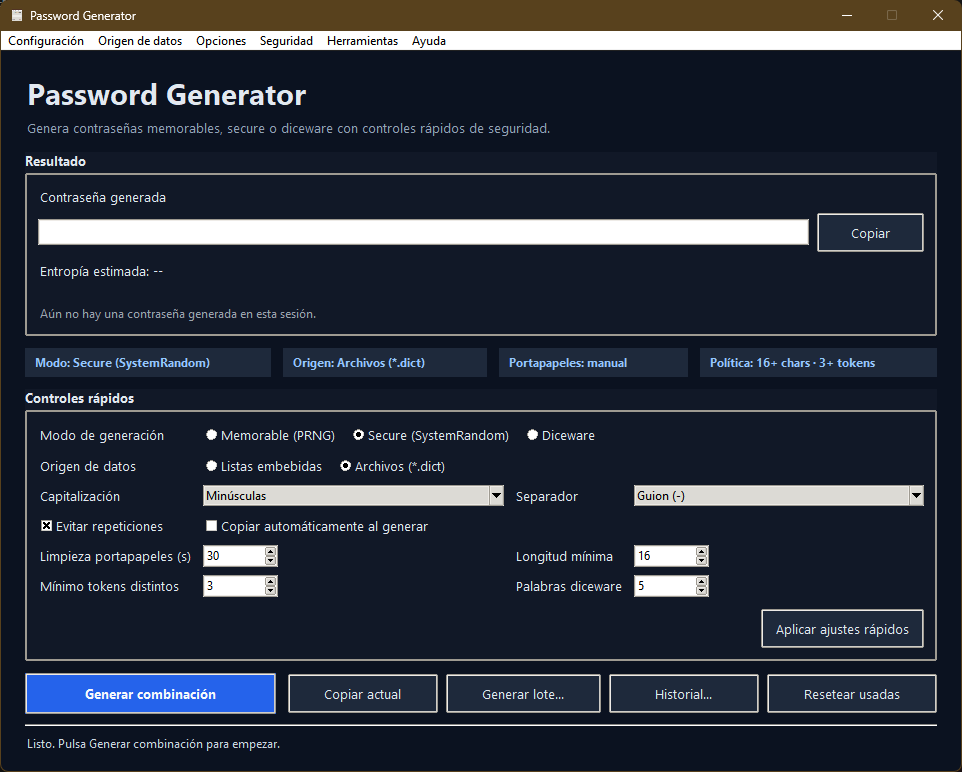

# Password Generator

Generador de contraseñas de escritorio en **Python + Tkinter**, orientado a
contraseñas memorables con enfoque práctico de seguridad.

Soporta tres estrategias de generación:

- `memorable` (PRNG)
- `secure` (`SystemRandom`)
- `diceware`

Incluye estimación de entropía, controles de política mínima, portapapeles con
limpieza opcional, historial y generación por lotes.

---

## Tabla de contenidos

- [Características](#características)
- [Captura](#captura)
- [Arquitectura y estructura](#arquitectura-y-estructura)
- [Requisitos](#requisitos)
- [Instalación](#instalación)
- [Ejecución](#ejecución)
- [Configuración](#configuración)
- [Desarrollo local](#desarrollo-local)
- [Build de ejecutable](#build-de-ejecutable)
- [Contribuir](#contribuir)
- [Plantillas de GitHub](#plantillas-de-github)
- [Licencia](#licencia)

---

## Características

- Interfaz moderna con controles rápidos y feedback de estado.
- Origen de datos dual:
  - listas embebidas,
  - archivos `.dict` configurables.
- Modos de generación:
  - **memorable**
  - **secure**
  - **diceware**
- Estimación de entropía y señales visuales de seguridad.
- Políticas configurables para exportes por lote.
- Copiado al portapapeles con limpieza automática opcional.
- Build para Windows con PyInstaller.

---

## Captura



---

## Arquitectura y estructura

```text
password-generator/
├─ .github/
│  ├─ workflows/
│  │  └─ ci.yml
│  ├─ ISSUE_TEMPLATE/
│  │  ├─ bug_report.md
│  │  ├─ feature_request.md
│  │  └─ config.yml
│  └─ pull_request_template.md
├─ assets/
│  ├─ icon.ico
│  ├─ icon.png
│  ├─ banner.png
│  └─ README.md
├─ build/
│  ├─ build.ps1
│  ├─ password-generator.spec
│  └─ README.md
├─ dict/
│  ├─ santos.dict
│  ├─ senas.dict
│  ├─ contrasenyas.dict
│  └─ README.md
├─ password_generator/
│  ├─ ui.py
│  ├─ core.py
│  ├─ infra.py
│  ├─ security.py
│  ├─ clipboard.py
│  ├─ models.py
│  ├─ defaults.py
│  ├─ __main__.py
│  └─ README.md
├─ generador.py
├─ config.example.json
├─ CONTRIBUTING.md
├─ pyproject.toml
└─ README.md
```

---

## Requisitos

- Python `3.13+`
- `pip`
- Windows, macOS o Linux

---

## Instalación

### Entorno de desarrollo

```powershell
python -m venv .venv
.venv\Scripts\activate
python -m pip install --upgrade pip
pip install -e ".[dev]"
```

### Instalación mínima (solo ejecución)

```powershell
python -m venv .venv
.venv\Scripts\activate
pip install -e .
```

---

## Ejecución

### Opción 1: entrada legacy

```powershell
python generador.py
```

### Opción 2: módulo Python

```powershell
python -m password_generator
```

### Opción 3: script instalado

```powershell
password-generator
```

---

## Configuración

- `config.json` se considera configuración local (no versionada).
- Usa `config.example.json` como base inicial.

```powershell
Copy-Item config.example.json config.json
```

Parámetros principales:

- `modo`: `embebido` o `archivos`
- `modo_generacion`: `memorable`, `secure`, `diceware`
- `formato`: capitalización y separador
- `seguridad`: mínimos de política
- `clipboard`: comportamiento de copiado y limpieza

---

## Desarrollo local

### Calidad estática

```powershell
python -m mypy password_generator
```

### Tests (opcional)

```powershell
python -m pytest
```

---

## Build de ejecutable

```powershell
.\build\build.ps1
```

Salida esperada:

- `dist/password-generator.exe`

Notas:

- El spec usa `assets/icon.ico` cuando está disponible.
- Se incluyen recursos de `assets/`, `dict/` y `config.example.json`.

---

## Contribuir

¡Contribuciones bienvenidas!

Para mantener consistencia y calidad:

1. Haz fork o crea una rama desde `main`.
2. Crea una rama descriptiva:
   - `feat/<descripcion-corta>`
   - `fix/<descripcion-corta>`
3. Implementa cambios y añade/actualiza pruebas cuando aplique.
4. Ejecuta validaciones locales:
   - `python -m mypy password_generator`
   - `python -m pytest` (opcional, si la suite está disponible en tu rama)
5. Crea commits claros y enfocados.
6. Abre PR con contexto, alcance y evidencia de pruebas.

Guía completa:

- `CONTRIBUTING.md`

---

## Plantillas de GitHub

Se incluyen plantillas para estandarizar colaboración:

- PR template: `.github/pull_request_template.md`
- Issue templates:
  - `.github/ISSUE_TEMPLATE/bug_report.md`
  - `.github/ISSUE_TEMPLATE/feature_request.md`
- Configuración de issue templates:
  - `.github/ISSUE_TEMPLATE/config.yml`

---

## Licencia

DO WHAT THE FUCK YOU WANT TO PUBLIC LICENSE (WTFPL) v2.
